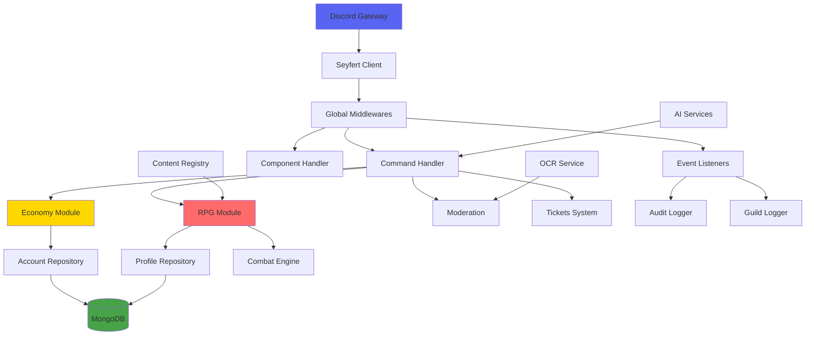

# Tx - Seeker Architecture Brief

**Purpose:** A feature-rich Discord bot combining advanced moderation, deep economy systems, and RPG mechanics built with TypeScript/Seyfert

---

## Tech Stack

| Layer | Technology |
|-------|------------|
| **Language** | TypeScript 5.9 |
| **Framework** | Seyfert 3.2.5 (Discord.js alternative) |
| **Database** | MongoDB (native driver) |
| **Package Manager** | Bun 1.2.20 |
| **Validation** | Zod 4.1.13 |
| **AI Services** | OpenAI, Google Gemini |
| **OCR** | PaddleOCR + ONNX Runtime |
| **Image Processing** | Sharp |
| **Linting** | Biome |

---

## Architecture Overview

### Directory Structure

```
src/
├── index.ts              # Entrypoint - bootstrap client, DB, middlewares
├── commands/            # 158 items - Discord slash commands
│   ├── _test/          # Test command utilities
│   ├── ai/             # CLANKER AI commands
│   ├── automod/        # Moderation automation
│   └── ...
├── components/          # 18 items - UI handlers (buttons, modals)
├── events/
│   ├── handlers/       # Bridge Seyfert events → typed hooks
│   └── listeners/      # Business logic responders
├── modules/
│   ├── economy/        # 124 items - Currency & transactions
│   ├── rpg/            # 56 items - Profile, combat, gathering
│   ├── inventory/      # Item storage & mutations
│   ├── market/         # Trading system
│   ├── autorole/       # Auto role assignment
│   ├── tickets/        # Support ticket system
│   ├── content/        # Quest/item content packs
│   └── ui/             # UI abstractions
├── systems/            # 5 items - Complex orchestrations (TOPs)
├── services/           # External integrations (AI, OCR)
├── db/
│   ├── mongo.ts        # Connection singleton
│   ├── schemas/        # Zod schema definitions
│   └── repositories/   # Data access layer
└── middlewares/        # Global command guards
```

### Key Principles

1. **Hooks & Listeners Pattern**: Events flow from `handlers` → `hooks` → `listeners` for decoupled business logic
2. **Repository Pattern**: All DB access through `src/db/repositories/*` with Zod validation
3. **Result Types**: RPG operations use `Result<T, RpgError>` for explicit error handling
4. **Validation at Edges**: Zod schemas enforce data integrity on entry and persistence
5. **Atomic Operations**: MongoDB `$set`, `$inc`, `$push` for concurrency safety

---

## Critical Data Flows

### 1. Command Execution Flow
```
Discord Interaction
    ↓
Seyfert Client
    ↓
Global Middlewares [featureToggle, moderationLimit, guard, cooldown]
    ↓
Command Handler
    ↓
Module/Service Layer
    ↓
Repository (Zod validation)
    ↓
MongoDB
```

### 2. Economy Transaction Flow
```
Transfer Request
    ↓
EconomyService.transfer()
    ↓
CurrencyMutationService.atomicTransfer()
    ↓
AccountRepository.update() [atomic $inc]
    ↓
AuditLogService.record()
    ↓
GuildLogger.notify()
```

### 3. RPG Combat Flow
```
Fight Invite
    ↓
Verify both profiles + isFighting === false
    ↓
CombatSession.create(TTL 5min)
    ↓
Accept → Lock both (isFighting = true)
    ↓
CombatEngine.resolveRound(moveA, moveB)
    ↓
StatsCalculator.applyDamage()
    ↓
Combat End → Update wins/losses + Restore HP + Unlock
```

---

## Key Modules

| Module | Purpose | Size |
|--------|---------|------|
| `modules/economy/` | Multi-currency system, transfers, taxes, accounts | 124 files |
| `modules/rpg/` | Profiles, combat, gathering, processing, upgrades | 56 files |
| `modules/inventory/` | Item storage, capacity, mutations | 9 files |
| `modules/content/` | JSON5 content packs (quests, items, recipes) | 7 files |
| `modules/market/` | Trading, buy/sell listings | 6 files |
| `modules/autorole/` | Reaction roles, auto-assignments | 12 files |
| `commands/` | All Discord slash commands | 158 items |

---

## Dependencies

### External
- **Discord API** via Seyfert
- **MongoDB** (self-hosted or Atlas)
- **OpenAI/Gemini** for AI chat features
- **PaddleOCR** for image text extraction

### Internal Coupling
- RPG depends on Economy (account gating)
- Inventory mutations used by RPG, Market, Economy
- Audit system tracks all cross-module operations
- UI layer abstracts Seyfert for consistent UX

---

## Content System

```
content/packs/
├── rpg.craftables.json    # Crafting recipes
├── rpg.drop_tables.json   # Loot tables
├── rpg.locations.json     # Gathering spots
├── rpg.processables.json  # Processing recipes
├── rpg.tools.json         # Tool definitions
├── quests/
│   ├── daily.quests.json5
│   ├── weekly.quests.json5
│   └── starter.quests.json5
└── unique.items.json5     # Special items
```

**CLI Tools:**
- `bun run content:validate` - Schema validation
- `bun run content:compile` - Build registry
- `python tools/rpg_content_cli.py` - Content editing CLI

---

## Skills Assessment

### ✅ Installed
- **find-skills** - Skill discovery from skills.sh ecosystem

### 🔧 Suggested Custom Skills

1. **discord-bot-analyzer**
   - Parse Seyfert command definitions
   - Extract middleware chains
   - Map component handlers to commands
   - Identify permission requirements

2. **rpg-system-analyzer**
   - Trace combat stat calculations
   - Validate economy balance formulas
   - Check content pack consistency

3. **mongo-zod-validator**
   - Cross-reference schemas with repositories
   - Detect missing indexes
   - Validate query patterns

4. **discord-ui-cop**
   - Check button/modal handler consistency
   - Validate ephemeral message patterns
   - Detect missing UI cleanup

---

## Next Steps / Unclear Areas

1. **Event Bus Complexity**: Hook system has 49 event files - document the event taxonomy
2. **Economy Taxation**: Complex tax system with sectors (global/work/trade) needs flowchart
3. **AI Reputation**: How reputation detection integrates with moderation unclear
4. **OCR Integration**: Where image scanning triggers in moderation flow
5. **Quest Builder**: React app in `apps/quest-builder/` - document build/deploy

---

## Commands to Explore

```bash
# Test suites
bun run test-db      # Database integration tests
bun run test-unit    # Unit tests

# Content management
bun run content:validate
bun run content:compile
bun run quests:validate

# Development
bun run dev          # Watch mode
bun run build        # Production build
```

---

## Architecture Mermaid Diagram



---

**Analysis Date:** 2026-02-07  
**Confidence Level:** High - comprehensive docs + code exploration
