# System Maps - pyebot

## 1. Component Graph

Visual representation of the high-level architecture and dependencies.

## 2. Critical Flows

### AI Interaction Flow (Happy Path)

```mermaid
sequenceDiagram
    participant U as User
    participant S as Seyfert/Listener
    participant AI_S as AI Service
    participant RL as AI Rate Limiter
    participant P as Provider (Gemini/OpenAI)

    U->>S: Message / Command
    S->>AI_S: processMessage / generateForGuild
    AI_S->>RL: consume(userId)
    alt is allowed
        RL-->>AI_S: OK
        AI_S->>P: generate
        P-->>AI_S: response text
        AI_S-->>S: AIResponse
        S-->>U: Reply
    else is blocked
        RL-->>AI_S: Blocked (Reset in Xs)
        AI_S-->>S: Error Message
        S-->>U: "Has alcanzado el límite..."
    end
```

### Economy Transaction (Optimistic Concurrency)

## 3. State Machines & Invariants

### Ticket Lifecycle

### Domain Invariants

| System         | Invariant                                               | Enforcement Point                                   |
| :------------- | :------------------------------------------------------ | :-------------------------------------------------- |
| **Economy**    | Balance cannot be negative (unless allowed by currency) | `Currency.isValid(next)` in `engine.apply`          |
| **Economy**    | Transaction updates must be atomic                      | Optimistic retry loop in `currencyTransaction`      |
| **Reputation** | Reputation must be non-negative integer                 | `clampRep` helper in `repositories/users.ts`        |
| **Tickets**    | User cannot exceed max tickets limit                    | Atomic `$size` check in `addOpenTicketIfBelowLimit` |
| **AI**         | Requests must respect guild-configured rate limits      | `aiRateLimiter.consume` in `AI Service`             |
| **Data**       | All DB reads/writes must match Schema                   | `UserSchema.parse` in `repositories/users.ts`       |
