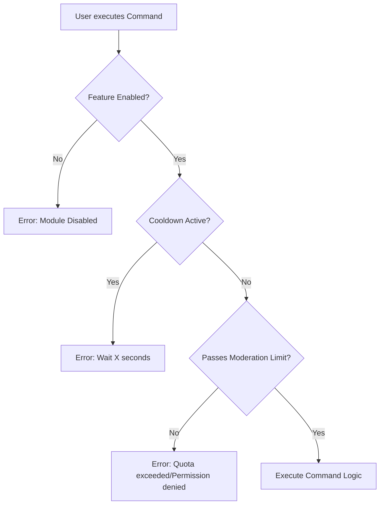

# Security and Execution Flow

This document details the security "pipeline" that each command goes through before executing. The system uses the **Middleware** pattern to ensure that all control policies are applied consistently and centrally, avoiding duplicated protection logic in each individual command.

## Middleware Pipeline

The execution order is critical for the bot's efficiency and security. Middlewares are executed sequentially; if one fails (returns an error or stops execution), the command **is not executed**.

### 1. Feature Toggle

_First level of defense._

- **Purpose**: Check if the system the command belongs to is enabled globally on the server.
- **Operation**: Queries the `ConfigStore` to see if the "Feature" (e.g., `Tickets`, `Economy`) is active.
- **Behavior**: If the feature is disabled, the command is immediately cut off with an ephemeral message ("This module is disabled on this server").
- **Benefit**: Allows administrators to turn off entire modules instantly without restarting the bot.

### 2. Cooldowns

_Protection against abuse._

- **Purpose**: Prevent spam and resource saturation.
- **Operation**: Uses in-memory "buckets" (local memory currently) to track when a user last used a specific command.
- **Context**: Cooldowns can be per user, per channel, or global.
- **Behavior**: If the user is on cooldown, they are notified how long they must wait.

### 3. Moderation Limits (Role Limits)

_Advanced permission policy._

- **Purpose**: Ensure that moderators do not abuse their permissions or make costly mistakes (e.g., banning 100 users in 1 minute).
- **Operation**:
  - **Overrides**: Checks if the user's role has explicit permission (`ALLOW`/`DENY`) for that specific action, overriding Discord native permissions.
  - **Quotas (Rate Limits)**: Checks if the role has an action quota (e.g., "Max 5 bans per hour").
- **Behavior**: If the limit is exceeded or permission is denied, an audit alert is generated and the action is blocked.

## Conceptual Flow Diagram

## Extensibility

To add a new security layer (e.g., a global blacklist), a new middleware must be created and registered at the global entry point (`src/index.ts`). This ensures that the new rule is applied instantly to **all** existing and future commands.
