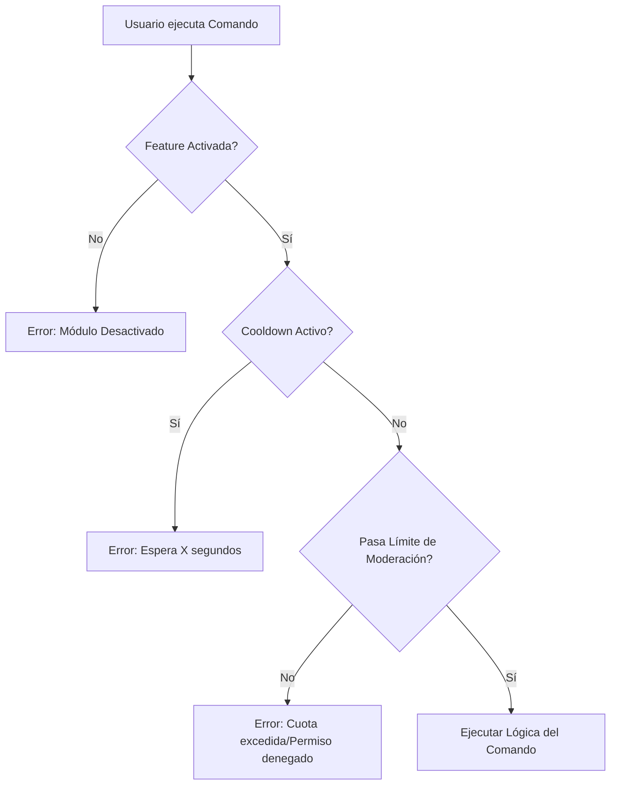

# Seguridad y Flujo de Ejecución

Este documento detalla el "pipeline" de seguridad que atraviesa cada comando antes de ejecutarse. El sistema utiliza el patrón de **Middleware** para asegurar que todas las políticas de control se apliquen de manera consistente y centralizada, evitando duplicar lógica de protección en cada comando individual.

## Pipeline de Middlewares

El orden de ejecución es crítico para la eficiencia y seguridad del bot. Los middlewares se ejecutan secuencialmente; si uno falla (retorna error o detiene la ejecución), el comando **no se ejecuta**.

### 1. Feature Toggle (Interruptor de Funciones)

_Primer nivel de defensa._

- **Propósito**: Verificar si el sistema al que pertenece el comando está habilitado globalmente en el servidor.
- **Funcionamiento**: Consulta el `ConfigStore` para ver si la "Feature" (ej. `Tickets`, `Economy`) está activa.
- **Comportamiento**: Si la feature está desactivada, el comando se corta inmediatamente con un mensaje efímero ("Este módulo está desactivado en este servidor").
- **Beneficio**: Permite a los administradores apagar módulos enteros instantáneamente sin reiniciar el bot.

### 2. Cooldowns (Enfriamiento)

_Protección contra abuso._

- **Propósito**: Prevenir el spam y la saturación de recursos.
- **Funcionamiento**: Utiliza "buckets" en memoria (`redis` o similar en el futuro, memoria local actualmente) para rastrear cuándo fue la última vez que un usuario usó un comando específico.
- **Contexto**: Los cooldowns pueden ser por usuario, por canal o globales.
- **Comportamiento**: Si el usuario está en enfriamiento, se le notifica cuánto tiempo debe esperar.

### 3. Moderation Limits (Límites de Rol)

_Política de permisos avanzada._

- **Propósito**: Asegurar que los moderadores no abusen de sus permisos o cometan errores costosos (ej. banear a 100 usuarios en 1 minuto).
- **Funcionamiento**:
  - **Overrides**: Verifica si el rol del usuario tiene un permiso explícito (`ALLOW`/`DENY`) para esa acción específica, sobrescribiendo los permisos de Discord.
  - **Cuotas (Rate Limits)**: Verifica si el rol tiene un cupo de acciones (ej. "Max 5 bans por hora").
- **Comportamiento**: Si se excede el límite o se deniega el permiso, se genera una alerta de auditoría y se bloquea la acción.

## Diagrama de Flujo Conceptual

## Extensibilidad

Para agregar una nueva capa de seguridad (ej. lista negra global), se debe crear un nuevo middleware y registrarlo en el punto de entrada global (`src/index.ts`). Esto garantiza que la nueva regla se aplique instantáneamente a **todos** los comandos existentes y futuros.
